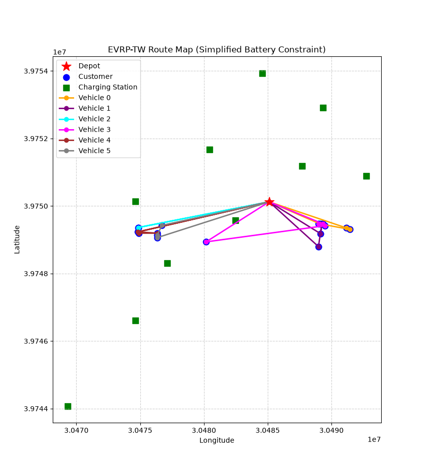
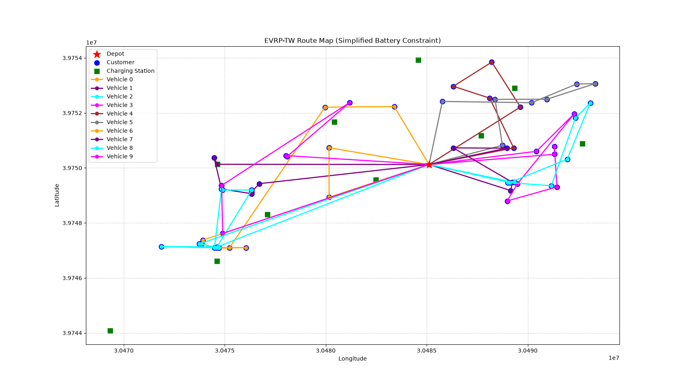
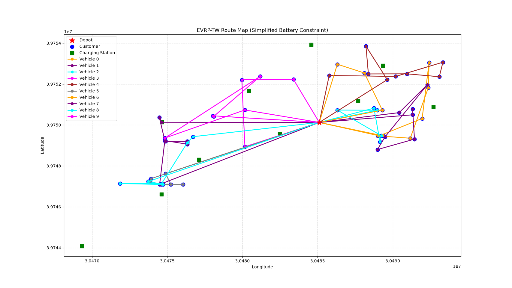

# Vehicle Routing Optimization: From Heuristics to Deep Reinforcement Learning

**SEP Summer Research Program - Final Report**

---

## 1. Introduction

Vehicle routing problem is a classic problem in logistics and distribution. The basic idea is quite simple: there is a depot, there are some customers, and there is a fleet of vehicles.

Started from the deport, the process is that vehicles try to serve all the customers then come back. And this article aims to optimize the routes so that the total driving distance would be minimized. This problem is a kind of NP-hard questions, Which means the complexity of the question would grow quickly while the number of customers increasing. So, the best solution might be quite hard to find in a reasonable time.

In fact, the base question is not enough. In the real world, the vehicles have loading capacity and the question would be the Capacitated VRP (CVRP). The customers have a time require, which means the vehicle must arrive during a specific period, so it becomes the VRPTW. When electric vehicles are used, their battery capacity becomes another limit, and the vehicle may need to visit charging stations along the way, so the question finally becomes the EVRP-TW. A closely related problem, the capacitated EVRP (CEVRP), which keeps the battery and capacity constraints but drops the time windows, has been solved with both exact and metaheuristic methods [1]–[3].

The table below shows these variants and the constraints that each of them adds.

| Variant | Constraint that it adds | Example from real life |
|---------|-------------------------|------------------------|
| CVRP | vehicle capacity | a truck that cannot carry too much |
| VRPTW | customer time windows | a delivery that must arrive on time |
| EVRP-TW | battery and charging stations | an electric truck that needs to charge |

This article follows a research line that goes from the simple problem to the complicated one. It first explored two traditional solvers, OR-Tools and PyVRP, then compared them on CVRP instances. Then it used OR-Tools to solve EVRP-TW instances from the ESOGU dataset, and studied how the battery capacity affects the solution. After that, it moved to the learning-based direction, and it built a custom EVRP-TW environment for the POMO model, which is a deep reinforcement learning method. The main questions are: which traditional solver is more suitable for the problem, when the battery constraint starts to change the route, and whether POMO can learn to solve EVRP-TW with a custom environment.

The rest of this report is organized like this. Section 2 introduces the methods and the code that it used. Section 3 shows the experiments and the results. Section 4 gives the discussion, and Section 5 concludes the project with some future work.

---

## 2. Methods and Code

### 2.1 OR-Tools

As a traditional solver, this article first explored OR-Tools and PyVRP. OR-Tools is an open-source toolkit from Google, providing a specialized solver for conventional VRP problems. Contrasting to solving a mathematical model directly from the data, OR-Tools tries to build a graphic model in which vehicles move along the routes. Then it uses a first solution strategy to quickly get an available solution. After that, it utilizes a local search metaheuristic to update and improve the current solution. Finally, when the time limit that is set manually is triggered, the solver returns the best solution that it has got so far.

In this article, the code uses two lines to define a model for the solver:

```python
manager = pywrapcp.RoutingIndexManager(n, num_vehicles, depot)
routing = pywrapcp.RoutingModel(manager)
```

The first line maps the nodes to the solver's internal indices, and the second line creates the routing model, which contains all the vehicles and their routes. Especially, this article has defined a kind of particular variables named "dimension". This kind of variables contain capacity, time and energy, featuring that their values keep changing along the path. For example, the capacity dimension accumulates the demand that has been served, and the energy dimension accumulates the battery that has been used. Each dimension has an upper limit, which works like a hard constraint for the vehicle.

As for the time window, the code uses

```python
time_dimension.CumulVar(index).SetRange(int(tw_early), int(tw_late))
```

to specify it. This line forces the arrival time at this node to stay in the range `[tw_early, tw_late]`. If the vehicle gets to the node earlier, the time period that is left would be received by the variable "slack", which means the vehicle just waits there until the customer is ready. In the EVRP-TW experiments, three dimensions are built for each instance: the capacity dimension, the time dimension and the energy dimension. The charging stations are also treated as special nodes, which do not consume any energy in the current model.

For the search part, the first solution strategy is set to `PARALLEL_CHEAPEST_INSERTION`, which inserts the customers one by one into the cheapest position. For the improvement part, `TABU_SEARCH` is used, which keeps a short memory of the recent moves and forbids the solver to repeat them. The solver is given 120 seconds for the 20-customer instance and 300 seconds for the 60-customer instance. In this way, the solver runs until the time limit is reached, and then it returns the best route that it has found.

### 2.2 PyVRP

PyVRP is another traditional solver. It uses the Hybrid Genetic Search (HGS) algorithm, which is a population-based method. Contrasting to OR-Tools, which improves a single solution, HGS keeps many solutions at the same time. In each round, it selects some good solutions as parents, and then it combines them to create new solutions. After that, it uses local search to improve the new solutions while keeping some diversity to avoid the solutions falling sameness. Because of this strategy, HGS is good at finding high-quality solutions on classical CVRP instances.

The code of PyVRP is quite simple:

```python
from pyvrp import read, solve
from pyvrp.stop import MaxIterations

instance = read(vrp_file, round_func="round")
result = solve(instance, stop=MaxIterations(5000), seed=42)
```

The `read` function loads the `.vrp` file, which contains the coordinates, the demands and the capacity. The `solve` function runs the search until the stopping condition that is chosen is met. In the experiments, `MaxIterations(5000)` is used as the stopping rule, and the seed is fixed to 42 so that the result is reproducible. It is also compared with OR-Tools on the same instances, which gives a clear picture about the strength of each solver.

### 2.3 POMO + RL4CO

After finishing the traditional solvers, this article moved to deep reinforcement learning, which is the learning-based direction of the project. It chose POMO, which stands for Policy Optimization with Multiple Optima. The main idea of POMO is that a routing problem has many symmetric optimal solutions, and a fixed start node wastes this symmetry. So instead of rolling out one tour from a single start, POMO rolls out multiple tours from different start nodes at the same time, and then it compares these tours with a shared baseline to update the model. This gives the model a stronger learning signal, and it also reduces the variance of the training.

It built POMO on the RL4CO framework, which is a library based on PyTorch and Lightning. RL4CO has already implemented many routing environments and models, but it does not have an EVRP-TW environment. So the biggest work in this part was to write a custom environment. The environment is saved in `src/POMO_Test_2.py`, which contains four parts.

The first part is `EVRP_TWGenerator`, which creates random instances for training. Each instance contains a depot, some charging stations and some customers. For the customers, the generator gives them random coordinates, demands, time windows and service times. The nodes are indexed in a fixed way: index 0 is the depot, index 1 to `num_stations` are the charging stations, and the rest are the customers. The number of decoding steps is also set to the total number of nodes, so that the model has enough steps to visit the stations and the depot as well.

The second part is `EVRP_TWEnv`, which is the environment class that the model interacts with. It has a `_reset` method, which puts the vehicle at the depot with a full battery and a full capacity. It also has a `_step` method, which moves the vehicle to the node that the model chooses, and then updates the distance, the time, the battery and the capacity. When the vehicle visits a station or the depot, the battery is set back to full. When it visits the depot, the capacity is also set back to full.

The third part is the action mask, which is the key to enforce the hard constraints. In each step, the model can only choose the nodes that are not masked. The mask blocks the customers that have already been visited, the customers whose demand is larger than the remaining capacity, the nodes that cannot be reached with the current battery, and the customers whose time window would be violated. It also blocks the depot when the vehicle is already there and there are still feasible customers to serve. In this way, the model never performs an illegal action during training, so there is no need to add a penalty in the reward function.

The fourth part is the reward and the training entry. The reward is the negative total tour length, which includes the return to the depot at the end. The training entry creates the environment, then creates the POMO model with a batch size of 64, and then fits it with the RL4CO trainer using the GPU. The code looks like this:

```python
env = EVRP_TWEnv(
    generator_params=dict(num_loc=5, num_stations=2),
    check_solution=False,
)
model = POMO(env, batch_size=64, optimizer_kwargs={"lr": 1e-4})
trainer = RL4COTrainer(max_epochs=1, accelerator="gpu")
trainer.fit(model)
```

Before this environment, a baseline test of POMO was first run on TSP20, which is the traveling salesman problem with 20 cities. The purpose of this test was to check that the RL4CO pipeline and the GPU are working correctly. The test passed, and the model was trained for one epoch in about 102 seconds. After that, the EVRP-TW environment was finished and its basic functions were tested one by one. The reset, the step, the mask and the reward all work correctly on small random instances. The POMO training on EVRP-TW has not been run yet, and this is the next step that is going to be done.

---

## 3. Experiments and Results

### 3.1 Experiment 1: Comparing PyVRP and OR-Tools on CVRP

In this experiment, two instances from the Augerat dataset are used, A-n32-k5 and A-n55-k9. The first one is a small instance, which has 31 customers, and the second one is a medium instance, which has 54 customers. Both of them have a known best solution, so the gap can be used to measure the quality of the results. For PyVRP, the stopping rule is set to 5000 iterations and the seed is fixed to 42. For OR-Tools, the default setting and the guided local search setting are tried, and the solver is given enough time to search.

**A-n32-k5 (small, 31 customers)**

| Solver | Objective | Vehicles | Time (s) | Gap |
|--------|-----------|----------|----------|-----|
| PyVRP | 784 | 5 | 1.14 | 0.00% |
| OR-Tools | 784 | 5 | 0.25 | 0.00% |

**A-n55-k9 (medium, 54 customers)**

| Solver | Objective | Vehicles | Time (s) | Gap |
|--------|-----------|----------|----------|-----|
| PyVRP | **1073** | 9 | 1.92 | **0.00%** |
| OR-Tools (default) | 1118 | 9 | 0.06 | 4.19% |
| OR-Tools (GLS) | 1110 | 9 | 0.27 | 3.45% |

It can be seen that both solvers found the optimal solution on the small instance, and OR-Tools was even faster. But on the medium instance, the story is different. PyVRP found the known best solution 1073 in about 2 seconds, while OR-Tools got stuck at 1110 or 1118, which means a gap around 3.5% to 4.2%. Even when OR-Tools is given a much longer time, the result does not improve. The reason is that OR-Tools searches from one solution, so it is easy to fall into a local optimum. PyVRP keeps a population of solutions, so it has more chances to escape from the local optimum.

### 3.2 Experiment 2: Battery Capacity Sensitivity on EVRP-TW

In this experiment, OR-Tools is used to solve two EVRP-TW instances from the ESOGU dataset, one with 20 customers and one with 60 customers. Both instances have a depot and 10 charging stations. The consumption rate is fixed to 0.2 kWh per kilometer, and then the battery capacity is changed to see how the solution changes. For each capacity value, it is recorded whether the problem is feasible, what the objective value is, and whether the route visits any charging station.

**20 customers (ESOGU_C20_TW1)**

| Battery (kWh) | Feasible | Objective | Station visits |
|---------------|----------|-----------|----------------|
| No battery (VRPTW) | Yes | 12939 | No |
| 100000 | Yes | 12939 | No |
| 697 (critical) | Yes | 12939 | No |
| 696 | No | - | - |

**60 customers (ESOGU_C60_TW1)**

| Battery (kWh) | Feasible | Objective | Station visits |
|---------------|----------|-----------|----------------|
| No battery (VRPTW) | Yes | 30142 | No |
| 100000 | Yes | 30142 | Yes (2) |
| 921 (critical) | Yes | 30520 | Yes (2) |
| 920 | No | - | - |

The routes of the two instances are visualized below. Figure 1 shows the 20-customer instance without a battery constraint. Figure 2 and Figure 3 show the 60-customer instance without and with the critical battery capacity (921 kWh), respectively. The red star marks the depot, the blue circles are the customers, and the green squares are the charging stations.







From the tables, some interesting findings can be got. First, for the 20-customer dataset, the minimal capacity is 697 kWh, but the route at this value is exactly the same as the route without a battery. So the critical value here may come from a numerical issue of the solver, not from a real physical setting. Second, for the 60-customer instance, the minimal capacity is 921 kWh, and the route changes. The whole distance increases from 30142 to 30520, and the route now visits two charging stations. Third, the charging stations are not only used for charging. In the 60-customer dataset, even when the battery is very full, the vehicle still visits two stations. That means the stations may also be used as time checkpoints, because the vehicle can wait there to fit the time requires.

### 3.3 Experiment 3: POMO Baseline and the EVRP-TW Environment

Before POMO is trained on EVRP-TW, a baseline test has been run on TSP20 datasets, which is the traveling salesman problem with 20 cities. The purpose of this test is to check that the RL4CO framework and the GPU are working normally. The result is shown below.

| Metric | Value |
|--------|-------|
| GPU available | True |
| Epoch | 1 |
| Training batches | 1563 |
| Training time | ~102 s |
| Average reward (train) | -4.017 |
| Average reward (val) | -3.952 |
| Model parameters | 1.3 M |

The test has shown that the POMO framework the article has built so far is working normally. And the model has been tested on small-scale datasets. However, because the training of POMO on EVRP-TW is still incomplete, the comparison between POMO and traditioanal solvers is still missing. And this would be the next stage of the reasearch.

---

## 4. Discussion

### 4.1 What is learned from the traditional solvers

From the first experiment, it can be seen that the choice of a solver matters. On small instances, both OR-Tools and PyVRP are fast and accurate, so either of them is fine. On medium instances, PyVRP gives a better solution, because it uses a population-based search, which is harder to get stuck. But PyVRP is not designed for every kind of constraint. When the article moved to EVRP-TW, OR-Tools is used, because it has the dimension mechanism, which makes it convenient to add time and energy constraints. So there is a trade-off: PyVRP is good at the classical problem, and OR-Tools is good at the extended problem.

### 4.2 What the battery experiment tells

The battery experiment has revealed an interesting finding that the battery factor does not always change the route. On the 20-customer instance, the constraint is too loose, that means the critical capacity is not necessary. On the 60-customer instance, the constraint starts to matter, and the route changes. This indicates that the instance and the parameters should be chosen carefully. If the environment settings is too loose, the limitations could not be reflected. If it is too tight, the problem becomes infeasible. The charging station also has another feature, which is easy to miss. In the current model, the stations do not really charge the vehicle, they just do not consume energy. That means a simplified model may underestimate the role of charging stations [1], [2].

### 4.3 Limitations of this project

There are some limitations that should be mentioned. First, only two CVRP instances and two EVRP-TW instances are tested, so the conclusion may not hold on other instances. Second, the battery consumption is linear, which is not very realistic. In real driving, the consumption depends on speed, load and road conditions. Third, the charging stations are not modeled as real chargers, so the charging time cannot be measured. Fourth, the POMO part is still at the environment stage, and there is no training result yet. Because of these limitations, the findings of this report are more like a preliminary exploration, not a final conclusion.

### 4.4 Is the learning-based method worth it?

The answer of this question is still open on the current stage of the research. The advantage of POMO is that, once the model is trained, the inference is very fast, and the model can solve new instances without rebuilding the model. This is different from the traditional solvers, which need to run the search again for every new instance; recent metaheuristics keep pushing the state of the art on these problems [3]. However, POMO also has some drawbacks. For example, the training is expensive. In addition, the quality of the solution is not guaranteed. In the previous research stage, the biggest cost is the environment settings, because the framework does not support EVRP-TW natively. With the environment working normally, the next question is whether the trained model can produce feasible and competitive solutions. This question will be answered in the next stage.

---

## 5. Conclusion and Future Work

In this project, the exploration goes from the traditional solvers to the learning-based methods. *Firstly, it ran OR-Tools and PyVRP on CVRP baseline, and the essay has found that PyVRP reaches the known optimum on both instances, while OR-Tools shows a gap around 3.5% on the medium instance. Then, it used OR-Tools to study the EVRP-TW problem with the ESOGU dataset. The results have indicated battery limit changes the route only when the capacity is tight enough, and the charging stations can also work as time checkpoints. After that, it built a custom EVRP-TW environment for the POMO model, which supports hard constraint masking for capacity, battery and time windows. The environment is complete and the basic functions are tested, and the POMO training is the next step.

For the future work, the plan is to do the following things. First, POMO will be trained on small EVRP-TW instances and compared with OR-Tools on the same instances. Second, the random instances will be replaced with the ESOGU data, so that the learning method is tested on the real problem. Third, the real charging behavior at the stations will be implemented, including the charging time and the energy that is restored. Fourth, the experiments will be scaled to more instances and more customers, so that the conclusions are more reliable. It is hoped that, in the end, the learning-based method can be a useful complement to the traditional solvers, providing a faster way to get good solutions when the problem becomes large.

---

## References

[1] Y.-H. Jia, Y. Mei, and M. Zhang, "A bilevel ant colony optimization algorithm for capacitated electric vehicle routing problem," *IEEE Trans. Cybern.*, vol. 52, no. 10, pp. 10855–10868, 2022.

[2] Y.-H. Jia, Y. Mei, and M. Zhang, "Confidence-based ant colony optimization for capacitated electric vehicle routing problem with comparison of different encoding schemes," *IEEE Trans. Evol. Comput.*, vol. 26, no. 6, pp. 1394–1408, 2022.

[3] C.-T. Feng, Y.-H. Jia, Q. Yang, W.-N. Chen, and H. Jiang, "A bilevel hybrid genetic algorithm for capacitated electric vehicle routing problem," in *Proc. IEEE Congr. Evol. Comput. (CEC)*, 2024, doi: 10.1109/CEC60901.2024.10611987.
